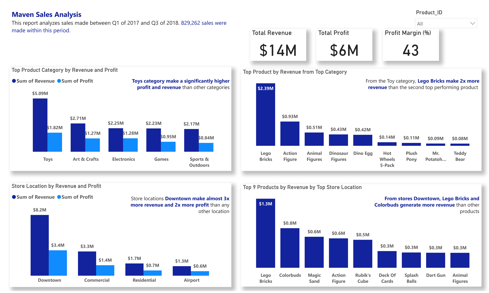

# Maven-Stores-Sales-Analysis
Analyzes revenue and profit of a chain of 50 stores .
----------------
## Overview
Maven Store is a chain of 50 stores across 29 cities. This report analyzes the sales, revenue, and profit generated between Q1 of 2017 and Q2 of 2018. The project is to analyze the product category generating the most revenue and profit, the top selling product from the top category, the store location making the most revenue and profit and the top 9 selling profit from the top store location.

## Dataset
The dataset consisted of 4 tables: store, inventory, sales, and product tables. The sales table is the fact table while the store and product tables are the dimension tables. The inventory table did not contain any relevant column for the analyzes.

## Data Cleaning and Manipulation
Duplicate values were removed from all tables using their IDs. The Power Query Merge function was used to join the cost and selling price from the product table to the sales table. This was necessary to calculate revenue and profit. 

## Data Analysis and Result

1.	The Toy category generate 2x more revenue with a significantly higher profit than other product category. 
2.	The toy category has 9 products with Lego Bricks generating 2x more revenue than the others.
3.	Store downtown generate 3x more revenue and 2x more profit than other stores.
4.	Lego Bricks is the leading selling product for stores downtown.

## Recommendation
Since toys accounts for most revenue generated, the inventory quantity of toy products should be watched closely. 
Also, marketing efforts should intensity in downtown and commercial regions since they account for two-third of the total revenue and profit. 

